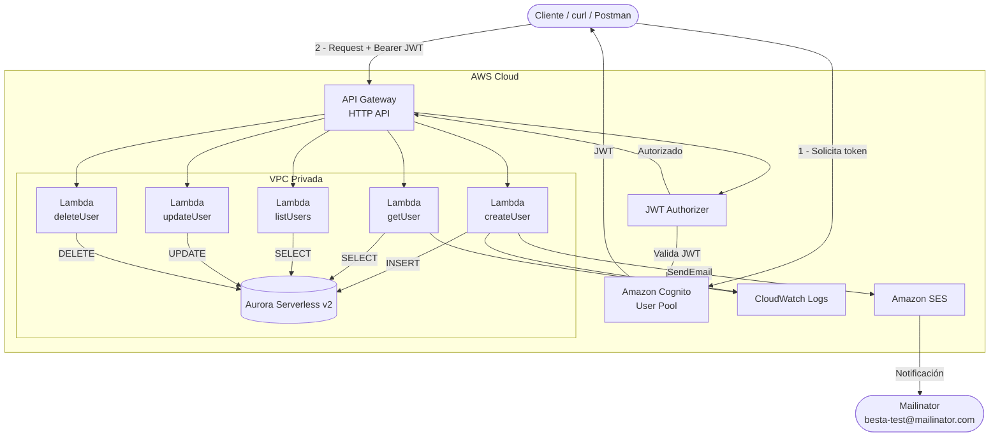

# besta-users-serverless-api

API REST serverless de producción para gestión de usuarios construida sobre infraestructura AWS, con Node.js 20, TypeScript, Lambda, API Gateway, RDS MySQL, Cognito y SES.

---

## Tabla de contenidos

1. [Descripción del proyecto](#descripción-del-proyecto)
2. [Diagrama de arquitectura](#diagrama-de-arquitectura)
3. [Componentes AWS](#componentes-aws)
4. [Estructura de carpetas](#estructura-de-carpetas)
5. [Prerequisitos](#prerequisitos)
6. [Variables de entorno](#variables-de-entorno)
7. [Instalación](#instalación)
8. [Ejecutar pruebas](#ejecutar-pruebas)
9. [Despliegue con Terraform](#despliegue-con-terraform)
10. [Despliegue automatico con GitHub Actions](#despliegue-automatico-con-github-actions)
11. [Autenticación con Cognito](#autenticación-con-cognito)
12. [Registro y autenticación desde el frontend](#registro-y-autenticación-desde-el-frontend)
13. [Endpoints con curl](#endpoints-con-curl)
14. [Verificación de email en Mailinator](#verificación-de-email-en-mailinator)
15. [Documentación OpenAPI](#documentación-openapi)
16. [Notas de seguridad](#notas-de-seguridad)
17. [Mejoras posibles](#mejoras-posibles)

---

## Descripción del proyecto

`besta-users-serverless-api` expone un CRUD completo de usuarios protegido con JWT de Amazon Cognito. Al crear un usuario se envía automáticamente un email de notificación vía Amazon SES a `besta-test@mailinator.com`. La infraestructura completa se gestiona con Terraform.

---

## Diagrama de arquitectura



---

## Componentes AWS

| Componente | Uso |
|---|---|
| **API Gateway HTTP API** | Enrutamiento de peticiones HTTP y autorización JWT |
| **AWS Lambda** (×5) | Un handler por endpoint CRUD |
| **Amazon Cognito** | Autenticación de usuarios y emisión de JWT |
| **Amazon Aurora Serverless v2 (MySQL 8.0)** | Base de datos serverless con auto-scaling y Multi-AZ integrado |
| **Amazon SES** | Envío de email de notificación al crear usuario |
| **Amazon VPC** | Red privada con subredes públicas y privadas |
| **NAT Gateway** | Acceso a internet saliente desde Lambda/RDS |
| **IAM** | Roles y políticas de mínimo privilegio para Lambda |
| **CloudWatch Logs** | Observabilidad de Lambda y API Gateway |
| **Terraform** | Infraestructura como código |

---

## Estructura de carpetas

```raw
besta-users-serverless-api/
├── src/
│   ├── handlers/          # Un handler por endpoint Lambda
│   │   ├── createUser.ts
│   │   ├── getUser.ts
│   │   ├── listUsers.ts
│   │   ├── updateUser.ts
│   │   └── deleteUser.ts
│   ├── services/
│   │   ├── userService.ts   # Lógica de negocio
│   │   └── emailService.ts  # Integración con SES
│   ├── repositories/
│   │   └── userRepository.ts  # Todas las queries SQL
│   ├── db/
│   │   └── mysql.ts         # Pool de conexiones singleton
│   ├── schemas/
│   │   └── userSchemas.ts   # Validaciones Zod
│   ├── utils/
│   │   ├── response.ts      # Helpers de respuesta HTTP
│   │   └── errors.ts        # Jerarquía de errores tipados
│   └── types/
│       └── user.ts          # Interfaces TypeScript
├── tests/
│   ├── unit/                # Tests unitarios con mocks
│   └── handlers/            # Tests de handlers
├── migrations/
│   └── 001_create_users_table.sql
├── docs/
│   └── openapi.yaml
├── infra/                   # Terraform
│   ├── main.tf
│   ├── provider.tf
│   ├── variables.tf
│   ├── outputs.tf
│   ├── vpc.tf
│   ├── rds.tf
│   ├── iam.tf
│   ├── cognito.tf
│   ├── ses.tf
│   ├── lambda.tf
│   └── api-gateway.tf
├── .github/workflows/ci.yml
├── package.json
├── tsconfig.json
├── jest.config.js
├── .eslintrc.js
├── .prettierrc
├── CLAUDE.md
└── README.md
```

---

## Prerequisitos

- Node.js 20+
- npm 10+
- Terraform >= 1.5
- AWS CLI configurado (`aws configure`)
- Una cuenta AWS con permisos para crear los recursos listados
- Un dominio o email verificado en Amazon SES

---

## Variables de entorno

Copia `.env.example` a `.env` y completa los valores:

```bash
cp .env.example .env
```

| Variable | Descripción | Requerida |
|---|---|---|
| `DB_HOST` | Endpoint RDS (output de Terraform) | Sí |
| `DB_PORT` | Puerto MySQL (default `3306`) | Sí |
| `DB_NAME` | Nombre de la base de datos | Sí |
| `DB_USER` | Usuario MySQL | Sí |
| `DB_PASSWORD` | Contraseña MySQL | Sí |
| `AWS_REGION` | Región AWS (ej. `us-east-1`) | Sí |
| `SES_SENDER_EMAIL` | Email verificado en SES | Sí |
| `SES_NOTIFICATION_EMAIL` | Destinatario de notificaciones | Sí |
| `COGNITO_USER_POOL_ID` | ID del User Pool (output de Terraform) | Sí |
| `COGNITO_CLIENT_ID` | ID del App Client (output de Terraform) | Sí |

Las variables de entorno en Lambda se inyectan automáticamente por Terraform; el archivo `.env` es solo para referencia local.

---

## Instalación

```bash
# Clonar el repositorio
git clone <repo-url>
cd users-serverless-api

# Instalar dependencias
npm install
```

---

## Ejecutar pruebas

```bash
# Todas las pruebas con cobertura
npm test

# Modo watch
npm run test:watch

# Solo lint
npm run lint

# Formatear código
npm run format
```

Los tests no requieren credenciales AWS ni base de datos real. Todas las dependencias externas están mockeadas con Jest.

---

## Despliegue con Terraform

### 1. Empaquetar las funciones Lambda

```bash
npm run build
npm run package
# Genera function.zip en la raíz del proyecto
```

### 2. Configurar variables de Terraform

Crea el archivo `infra/terraform.tfvars` (está en `.gitignore`):

```hcl
db_password      = "TuContraseñaSegura123!"
ses_sender_email = "no-reply@tudominio.com"

# Opcionales – tienen valores por defecto
aws_region    = "us-east-1"
environment   = "dev"
project_name  = "besta-users"
```

### 3. Inicializar y aplicar

```bash
cd infra
terraform init
terraform plan
terraform apply
```

### 4. Anotar los outputs

```raw
api_url              = https://xxxxxxxxxx.execute-api.us-east-1.amazonaws.com/users
cognito_user_pool_id = us-east-1_XXXXXXXXX
cognito_client_id    = xxxxxxxxxxxxxxxxxxxxxxxxxx
aurora_endpoint      = besta-users-aurora-cluster.cluster-xxxxxxx.us-east-1.rds.amazonaws.com
```

### 5. Ejecutar la migración de base de datos

Conecta al RDS a través de un bastion host o AWS Systems Manager Session Manager:

```bash
mysql -h <aurora_endpoint> -u admin -p besta_users < migrations/001_create_users_table.sql
```

### 6. Destruir la infraestructura

```bash
cd infra
terraform destroy
```

---

## Despliegue automatico con GitHub Actions

El workflow `.github/workflows/ci.yml` ejecuta lint, format check, tests con coverage y build en `push`/`pull_request` hacia `main` y `develop`.

Cuando hay un `push` a `main`, el job `Package & Deploy` tambien:

1. Instala dependencias con `npm ci`.
2. Genera `function.zip` con `npm run package`.
3. Configura credenciales AWS.
4. Ejecuta `terraform init`.
5. Ejecuta `terraform apply -auto-approve -input=false`.
6. Sube `function.zip` como artifact del workflow.

El archivo `.env` es local y esta ignorado por Git. Para GitHub Actions debes copiar sus valores sensibles a **GitHub Secrets**:

| Secret | Valor sugerido |
|---|---|
| `AWS_ACCESS_KEY_ID` | Access key de un usuario/rol IAM con permisos para Terraform |
| `AWS_SECRET_ACCESS_KEY` | Secret key correspondiente |
| `AWS_REGION` | `us-east-1` |
| `DB_PASSWORD` | Mismo valor que `DB_PASSWORD` en `.env` |
| `SES_SENDER_EMAIL` | Mismo valor que `SES_SENDER_EMAIL` en `.env` |
| `SES_NOTIFICATION_EMAIL` | Mismo valor que `SES_NOTIFICATION_EMAIL` en `.env` |

En GitHub:

```text
Repository -> Settings -> Secrets and variables -> Actions -> New repository secret
```

Importante: para correr `terraform apply` desde GitHub de forma segura, configura un backend remoto de Terraform, por ejemplo S3 + DynamoDB. Si usas solo `terraform.tfstate` local, GitHub Actions no vera el estado de tu maquina y podria intentar recrear infraestructura.

---

## Autenticación con Cognito

### Crear un usuario de prueba

```bash
# Usando AWS CLI
aws cognito-idp admin-create-user \
  --user-pool-id us-east-1_XXXXXXXXX \
  --username testuser@example.com \
  --temporary-password "Temp1234!" \
  --user-attributes Name=email,Value=testuser@example.com Name=email_verified,Value=true \
  --message-action SUPPRESS

# Establecer contraseña definitiva
aws cognito-idp admin-set-user-password \
  --user-pool-id us-east-1_XXXXXXXXX \
  --username testuser@example.com \
  --password "MiPassword123!" \
  --permanent
```

### Obtener un JWT token

```bash
aws cognito-idp initiate-auth \
  --auth-flow USER_PASSWORD_AUTH \
  --client-id xxxxxxxxxxxxxxxxxxxxxxxxxx \
  --auth-parameters USERNAME=testuser@example.com,PASSWORD="MiPassword123!" \
  --query "AuthenticationResult.IdToken" \
  --output text
```

Guarda el token:

```bash
export TOKEN="eyJhbGciOiJSUzI1NiIsInR..."
export API_URL="https://xxxxxxxxxx.execute-api.us-east-1.amazonaws.com"
```

---

## Registro y autenticación desde el frontend

Esta sección explica paso a paso cómo un frontend (React, Vue, Next.js, etc.) puede registrar un usuario en Cognito, confirmar el email y obtener los JWT tokens para consumir la API.

### Flujo completo

```
Frontend                        Cognito                     API Gateway + Lambda
   |                               |                               |
   |--- 1. signUp() --------------->|                               |
   |<-- confirmación por email ---- |                               |
   |--- 2. confirmSignUp(código) -->|                               |
   |--- 3. signIn() --------------->|                               |
   |<-- { IdToken, AccessToken, --- |                               |
   |       RefreshToken }           |                               |
   |                               |                               |
   |--- 4. POST /users + Bearer IdToken --------------------------->|
   |<-- 201 Created ------------------------------------------------|
```

> **Tokens Cognito**
> - **IdToken** — contiene los claims del usuario (`email`, `sub`, etc.). Es el que se envía como `Bearer` en `Authorization`. Expira en 1 hora.
> - **AccessToken** — para operaciones propias de Cognito (cambiar contraseña, etc.). No se envía a esta API.
> - **RefreshToken** — permite renovar IdToken + AccessToken sin que el usuario vuelva a hacer login. Expira en 30 días.

---

### Paso 0 — Instalar la librería

```bash
npm install amazon-cognito-identity-js
```

No requiere AWS SDK completo. Compatible con cualquier framework frontend moderno.

---

### Paso 1 — Configurar el pool

Crea un archivo `src/lib/cognito.ts` (o `.js`) con los valores del output de Terraform:

```typescript
import {
  CognitoUserPool,
  CognitoUser,
  AuthenticationDetails,
  CognitoUserAttribute,
  ISignUpResult,
} from 'amazon-cognito-identity-js';

const POOL_DATA = {
  UserPoolId: 'us-east-1_XXXXXXXXX',   // cognito_user_pool_id del output Terraform
  ClientId: 'xxxxxxxxxxxxxxxxxxxxxxxxxx', // cognito_client_id del output Terraform
};

export const userPool = new CognitoUserPool(POOL_DATA);
```

Si usas variables de entorno (recomendado para no hardcodear los ids):

```typescript
const POOL_DATA = {
  UserPoolId: process.env.NEXT_PUBLIC_COGNITO_USER_POOL_ID!,
  ClientId: process.env.NEXT_PUBLIC_COGNITO_CLIENT_ID!,
};
```

---

### Paso 2 — Registro (Sign Up)

Cognito crea el usuario y, si el User Pool tiene verificación de email activada, envía un código de 6 dígitos al email ingresado.

```typescript
export function signUp(email: string, password: string): Promise<ISignUpResult> {
  const attributes = [
    new CognitoUserAttribute({ Name: 'email', Value: email }),
  ];

  return new Promise((resolve, reject) => {
    userPool.signUp(email, password, attributes, [], (err, result) => {
      if (err || !result) return reject(err);
      resolve(result);
    });
  });
}
```

**Uso en el componente:**

```typescript
try {
  await signUp('usuario@ejemplo.com', 'MiPassword123!');
  // redirigir a pantalla de confirmación
} catch (err) {
  // err.message contiene la descripción del error de Cognito
  console.error(err);
}
```

**Requisitos de contraseña por defecto de Cognito:**
- Mínimo 8 caracteres
- Al menos una mayúscula
- Al menos una minúscula
- Al menos un número
- Al menos un símbolo (configurable en el User Pool)

---

### Paso 3 — Confirmación del email

El usuario recibe un email con un código de 6 dígitos. El frontend debe pedirle ese código y enviarlo a Cognito para activar la cuenta.

```typescript
export function confirmSignUp(email: string, code: string): Promise<void> {
  const cognitoUser = new CognitoUser({ Username: email, Pool: userPool });

  return new Promise((resolve, reject) => {
    cognitoUser.confirmRegistration(code, true, (err) => {
      if (err) return reject(err);
      resolve();
    });
  });
}
```

**Reenviar el código si venció o no llegó:**

```typescript
export function resendConfirmationCode(email: string): Promise<void> {
  const cognitoUser = new CognitoUser({ Username: email, Pool: userPool });

  return new Promise((resolve, reject) => {
    cognitoUser.resendConfirmationCode((err) => {
      if (err) return reject(err);
      resolve();
    });
  });
}
```

---

### Paso 4 — Login y obtención de tokens (Sign In)

```typescript
import { CognitoUserSession } from 'amazon-cognito-identity-js';

export function signIn(email: string, password: string): Promise<CognitoUserSession> {
  const authDetails = new AuthenticationDetails({
    Username: email,
    Password: password,
  });
  const cognitoUser = new CognitoUser({ Username: email, Pool: userPool });

  return new Promise((resolve, reject) => {
    cognitoUser.authenticateUser(authDetails, {
      onSuccess: (session) => resolve(session),
      onFailure: (err) => reject(err),
      newPasswordRequired: () => reject(new Error('Se requiere cambio de contraseña')),
    });
  });
}
```

**Extraer el IdToken del resultado:**

```typescript
const session = await signIn('usuario@ejemplo.com', 'MiPassword123!');

const idToken     = session.getIdToken().getJwtToken();   // enviar como Bearer
const accessToken = session.getAccessToken().getJwtToken();
const refreshToken = session.getRefreshToken().getToken();

// Guardar en memoria o sessionStorage (nunca en localStorage por seguridad)
sessionStorage.setItem('idToken', idToken);
```

---

### Paso 5 — Llamar a la API con el token

Con el `idToken` obtenido en el paso anterior, todas las peticiones a la API deben incluir el header `Authorization: Bearer <idToken>`.

```typescript
const API_URL = 'https://xxxxxxxxxx.execute-api.us-east-1.amazonaws.com';

async function apiRequest(method: string, path: string, body?: unknown) {
  const idToken = sessionStorage.getItem('idToken');

  const response = await fetch(`${API_URL}${path}`, {
    method,
    headers: {
      'Authorization': `Bearer ${idToken}`,
      'Content-Type': 'application/json',
    },
    body: body ? JSON.stringify(body) : undefined,
  });

  if (!response.ok) {
    const error = await response.json();
    throw new Error(error.message || 'Error en la API');
  }

  return response.status === 204 ? null : response.json();
}

// Crear usuario
await apiRequest('POST', '/users', {
  name: 'Juan Pérez',
  email: 'juan@example.com',
  phone: '+5491234567890',
  role: 'user',
});

// Listar usuarios
const { items } = await apiRequest('GET', '/users?limit=10&offset=0');
```

---

### Paso 6 — Renovar el token automáticamente (Refresh)

El `IdToken` expira en **1 hora**. Antes de cada petición, conviene verificar si expiró y renovarlo con el `RefreshToken`.

```typescript
export function getCurrentSession(): Promise<CognitoUserSession | null> {
  const cognitoUser = userPool.getCurrentUser();
  if (!cognitoUser) return Promise.resolve(null);

  return new Promise((resolve, reject) => {
    cognitoUser.getSession((err: Error | null, session: CognitoUserSession | null) => {
      if (err || !session) return resolve(null);
      resolve(session);
    });
  });
}

// Wrapper que garantiza un token vigente antes de cada llamada
export async function getValidIdToken(): Promise<string> {
  const session = await getCurrentSession();
  if (!session || !session.isValid()) {
    throw new Error('Sesión expirada, por favor inicia sesión nuevamente');
  }
  // amazon-cognito-identity-js renueva el token automáticamente si el RefreshToken es válido
  return session.getIdToken().getJwtToken();
}
```

La librería `amazon-cognito-identity-js` renueva el `IdToken` en segundo plano usando el `RefreshToken` cuando llamas a `getSession()` y el token expiró. No es necesario manejar el refresh manualmente.

---

### Paso 7 — Logout (Sign Out)

```typescript
export function signOut(): void {
  const cognitoUser = userPool.getCurrentUser();
  if (cognitoUser) {
    cognitoUser.signOut();           // limpia tokens del almacenamiento local
  }
  sessionStorage.removeItem('idToken');
}
```

---

### Errores comunes de Cognito

| Código de error | Causa | Solución |
|---|---|---|
| `UsernameExistsException` | El email ya está registrado | Mostrar mensaje e ir a login |
| `UserNotConfirmedException` | Login antes de confirmar email | Redirigir a pantalla de confirmación |
| `NotAuthorizedException` | Contraseña incorrecta | Mostrar mensaje genérico |
| `CodeMismatchException` | Código de confirmación incorrecto | Permitir reintento o reenvío |
| `ExpiredCodeException` | El código de 6 dígitos venció | Reenviar código con `resendConfirmationCode` |
| `InvalidPasswordException` | La contraseña no cumple la política | Mostrar requisitos al usuario |
| `LimitExceededException` | Demasiados intentos | Esperar e informar al usuario |

---

### POST /users — Crear usuario

```bash
curl -X POST "$API_URL/users" \
  -H "Authorization: Bearer $TOKEN" \
  -H "Content-Type: application/json" \
  -d '{
    "name": "Juan Pérez",
    "email": "juan@example.com",
    "phone": "+5491234567890",
    "role": "user"
  }'
```

Respuesta `201`:
```json
{
  "id": "550e8400-e29b-41d4-a716-446655440000",
  "name": "Juan Pérez",
  "email": "juan@example.com",
  "phone": "+5491234567890",
  "role": "user",
  "createdAt": "2024-01-01T00:00:00.000Z",
  "updatedAt": "2024-01-01T00:00:00.000Z"
}
```

### GET /users — Listar usuarios

```bash
curl -X GET "$API_URL/users?limit=10&offset=0" \
  -H "Authorization: Bearer $TOKEN"
```

Respuesta `200`:
```json
{
  "items": [...],
  "limit": 10,
  "offset": 0,
  "total": 1
}
```

### GET /users/{id} — Obtener un usuario

```bash
curl -X GET "$API_URL/users/550e8400-e29b-41d4-a716-446655440000" \
  -H "Authorization: Bearer $TOKEN"
```

### PUT /users/{id} — Actualizar usuario

```bash
curl -X PUT "$API_URL/users/550e8400-e29b-41d4-a716-446655440000" \
  -H "Authorization: Bearer $TOKEN" \
  -H "Content-Type: application/json" \
  -d '{"name": "Juan Pérez Actualizado", "role": "admin"}'
```

### DELETE /users/{id} — Eliminar usuario

```bash
curl -X DELETE "$API_URL/users/550e8400-e29b-41d4-a716-446655440000" \
  -H "Authorization: Bearer $TOKEN"
```

Respuesta `204` sin cuerpo.

---

## Verificación de email en Mailinator

Al crear un usuario, el sistema envía un email de notificación a `besta-test@mailinator.com`.

Para verificar la entrega, abre el inbox público de Mailinator:

**[https://www.mailinator.com/v4/public/inboxes.jsp?to=besta-test](https://www.mailinator.com/v4/public/inboxes.jsp?to=besta-test)**

> **Nota importante sobre SES Sandbox:** En modo sandbox de SES, solo se pueden enviar emails a direcciones verificadas. Las direcciones de Mailinator no se pueden verificar como identidades SES. Para poder enviar a `besta-test@mailinator.com` debes:
> 1. Solicitar acceso a producción en SES (levantar el sandbox)
> 2. Ir a AWS Console → SES → Account dashboard → Request production access
> 3. Esperar la aprobación de AWS (generalmente 24 horas)

---

## Documentación OpenAPI

El archivo `docs/openapi.yaml` contiene la especificación completa de la API.

### Importar en Swagger Editor

1. Abre [https://editor.swagger.io](https://editor.swagger.io)
2. Menú `File > Import file`
3. Selecciona `docs/openapi.yaml`

### Importar en Postman

1. Abre Postman
2. `Import > File > Upload Files`
3. Selecciona `docs/openapi.yaml`
4. Crea una variable de entorno `token` con el JWT de Cognito
5. Configura la autorización como `Bearer Token: {{token}}`

---

## Notas de seguridad

- Todos los endpoints requieren JWT válido de Cognito. Sin token → `401`.
- Las credenciales de base de datos se pasan como variables de entorno a Lambda mediante Terraform; nunca se hardcodean en el código.
- RDS está en subredes privadas sin acceso público directo.
- Los Lambda están dentro de la VPC y solo tienen acceso a internet saliente vía NAT Gateway.
- Las políticas IAM de Lambda siguen el principio de mínimo privilegio: solo `ses:SendEmail`, `ses:SendRawEmail` y permisos de VPC/CloudWatch.
- `deletion_protection = false` en RDS es apropiado para dev/testing. Cambiar a `true` en producción.
- Las credenciales de RDS se almacenan en AWS Secrets Manager y se rotan automáticamente cada 7 días mediante `manage_master_user_password = true` en Terraform. Lambda lee el secret en cada cold start vía `GetSecretValue`.

---

## Mejoras posibles

| Mejora | Descripción |
|---|---|
| **RDS Proxy** | Reducir la carga de conexiones al cluster Aurora con múltiples invocaciones Lambda concurrentes |
| **WAF** | Web Application Firewall en API Gateway para protección adicional |
| **X-Ray** | Trazas distribuidas para depuración y rendimiento |
| **Paginación con cursor** | Mejor rendimiento que limit/offset para datasets grandes |
| **Soft delete** | Campo `deleted_at` en vez de DELETE físico |
| **Rate limiting** | Throttling por usuario en API Gateway |
| **Cache** | ElastiCache para respuestas frecuentes de lista/get |
| **OpenAPI auto-sync** | Generar spec automáticamente desde los schemas Zod |
| **CDK o SAM** | Alternativas a Terraform para despliegue serverless-first |
| **Terraform remote state** | S3 + DynamoDB para state compartido en equipo |
| **E2E tests** | Tests de integración contra el ambiente real con Cognito real |
